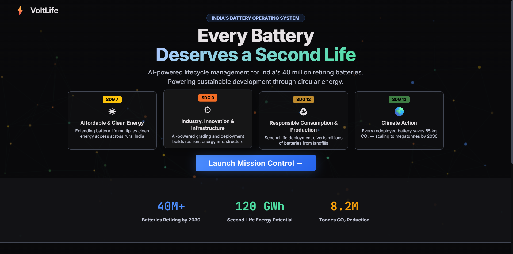
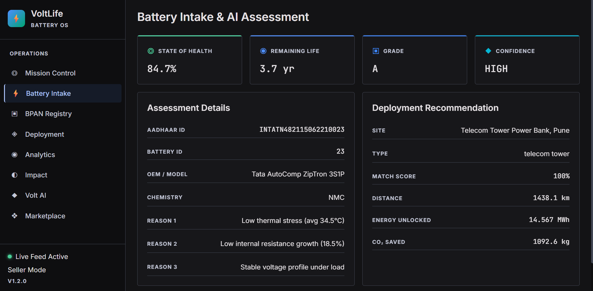
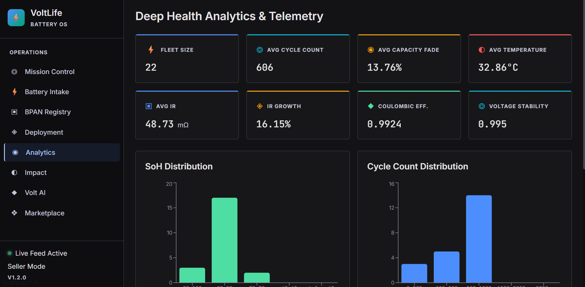
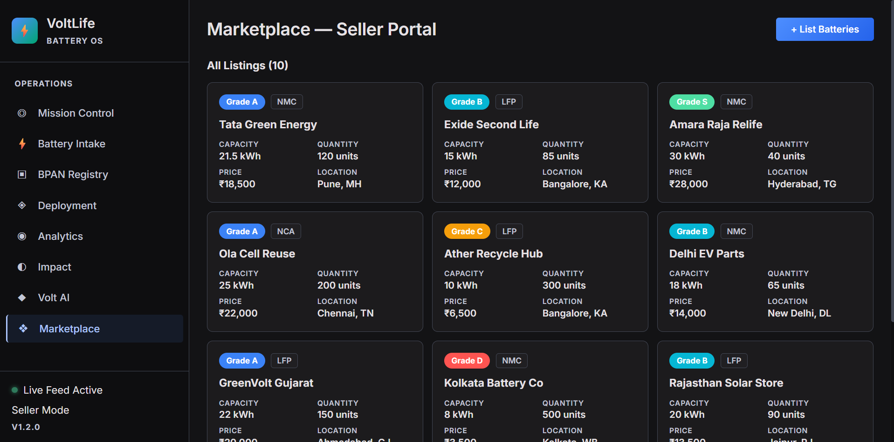
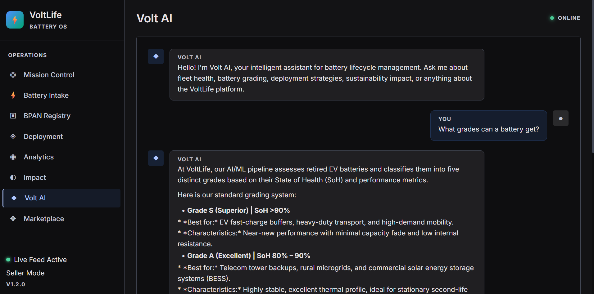

# VoltLife (BatteryOS)

**India will retire nearly 50 million EV batteries by 2030. VoltLife is an AI-powered battery lifecycle intelligence platform that determines the optimal second life for every retired battery.**

Built for [HackPrix 2026](https://hackprix.com) — Sustainable Development Track.

---

## The Problem

Retired EV batteries still hold 70–80% of their original capacity, yet most are sent directly to recycling — wasting residual value and generating avoidable environmental harm. India alone faces a wave of ~50 million retired batteries by 2030 with no scalable system to assess, grade, and redeploy them.

## Our Solution

VoltLife predicts each battery's **State of Health (SoH)** and **Remaining Useful Life (RUL)** using machine learning, then autonomously recommends the best second-life deployment — solar farms, microgrids, telecom towers, industrial backup, or recycling. Every battery receives a digital **Battery Aadhaar** (Battery Passport) for full lifecycle traceability.

---

## Key Features

### AI Health Assessment
- State of Health (SoH) prediction and Remaining Useful Life (RUL) estimation
- Confidence scoring with Explainable AI (SHAP) reasoning

### Intelligent Battery Grading
- Automated grading system (S → A → B → C → Recycle) based on predicted health metrics

### Autonomous Deployment Engine
- Recommends optimal second-life application by evaluating battery health, remaining capacity, carbon impact, transportation cost, and regional deployment demand

### Battery Aadhaar (Battery Passport)
- Unique battery ID with QR code generation
- Full lifecycle tracking: assessment history, deployment history, and digital passport

### Mission Control Dashboard
- Live battery monitoring with real-time AI assessments
- Interactive India map, sustainability metrics, and deployment analytics

### Hardware Integration
- UART/Serial battery data ingestion with live BMS telemetry for real-time AI assessment

---

## Architecture

```
Battery Telemetry (CSV · JSON · UART · API)
        │
        ▼
Feature Engineering
        │
        ▼
AI Health Engine ─── SoH · RUL · Confidence · Explainability
        │
        ▼
Battery Grading Engine
        │
        ▼
Deployment Optimization Engine
        │
        ▼
Battery Aadhaar Generation
        │
        ▼
Mission Control Dashboard + Sustainability Analytics
```

---

## Tech Stack

| Layer | Technologies |
|-------|-------------|
| **Frontend** | React, TypeScript, Vite, Tailwind CSS, shadcn/ui, Framer Motion, Recharts, React Leaflet, TanStack Query |
| **Backend** | FastAPI, Python, SQLAlchemy, Alembic, PostgreSQL, WebSockets, Pydantic |
| **ML** | Scikit-learn, XGBoost, SHAP, Pandas, NumPy |
| **Deployment** | Docker, GitHub Actions, Railway / Render |

---

## Screenshots

**Mission Control — Landing Dashboard**


**Battery Intake & AI Assessment**


**Deep Health Analytics & Telemetry**


**Marketplace — Seller Portal**


**Volt AI — Conversational Assistant**


---

## Demo

[Watch the full demo video](https://drive.google.com/file/d/1s-VAfKXjJK9hGBh0ha5JrMUH6dCSJc1T/view?usp=sharing)

---

## Getting Started

### Prerequisites
- Python 3.10+
- Node.js 18+
- PostgreSQL 15+

### Backend

```bash
cd backend
python -m venv venv
source venv/bin/activate      # Windows: venv\Scripts\activate
pip install -r requirements.txt
alembic upgrade head
uvicorn app.main:app --reload
```

### Frontend

```bash
cd frontend
npm install
npm run dev
```

### ML Pipeline

```bash
cd ml
pip install -r requirements.txt
python train.py
python predict.py
```

### Environment Variables

Copy `.env.example` to `.env` and fill in your credentials:

```bash
cp backend/.env.example backend/.env
```

Required variables include `DATABASE_URL`, `GEMINI_API_KEY`, and optionally `RAZORPAY_KEY_ID` / `RAZORPAY_KEY_SECRET` for payment integration.

---

## UN Sustainable Development Goals

| Goal | Alignment |
|------|-----------|
| SDG 7 | Affordable and Clean Energy |
| SDG 9 | Industry, Innovation and Infrastructure |
| SDG 11 | Sustainable Cities and Communities |
| SDG 12 | Responsible Consumption and Production |
| SDG 13 | Climate Action |

---

## Roadmap

- OEM API integrations for direct manufacturer data
- Live BMS data streaming pipeline
- Battery marketplace for second-life buyers and sellers
- Fleet management dashboard
- Carbon credit reporting
- Multi-country Battery Passport support

---

## Team

| Member | Role |
|--------|------|
| **Mohammed Raziullah** | Machine Learning & AI |
| **Farhan** | Backend Development |
| **Zaki** | Frontend Development |
| **Zaid** | System Architecture & Integration |

---

## License

This project was developed for **HackPrix 2026** and is intended for educational and research purposes.
