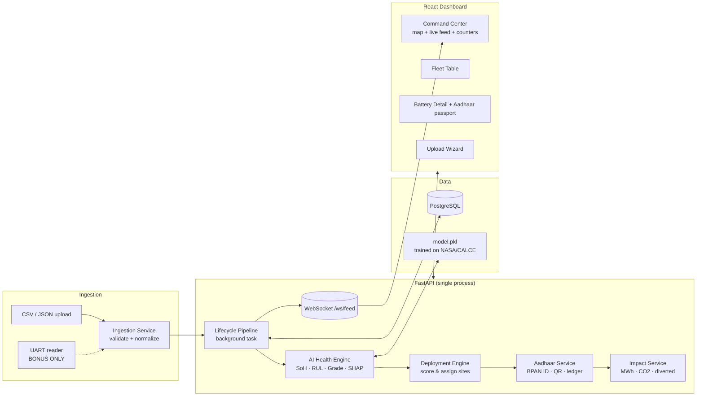

# 02 — System Architecture (Owner: Zaid)

## Golden rule

**One repo, one backend process, one database, one frontend.** No microservices, no queues, no Docker-compose orchestras. The ML model is a `.pkl` loaded inside FastAPI at startup. Anything fancier is integration risk with zero judge value.

## Diagram

## The lifecycle pipeline (the demo, in code)

`POST /ingest` stores raw records, returns `job_id`, and kicks off one FastAPI `BackgroundTask` that loops over batteries:

1. **Featurize** telemetry summary → feature vector
2. **Assess** → SoH, RUL (+interval), grade, confidence, SHAP top-3 reasons
3. **Decide** → score against demand registry → assignment + reasoning
4. **Identify** → BPAN-style Aadhaar + QR + lifecycle events
5. **Account** → increment impact totals
6. **Emit** → push `assessment`, `deployment`, `impact` events over WebSocket with `await asyncio.sleep(0.15)` pacing

That sleep is a feature: 847 batteries × ~0.15s ≈ 2 min of live cascading UI — exactly the demo window. Pace the stream, not the math.

## Key decisions (and why)

| Decision | Choice | Why |
|---|---|---|
| ML serving | In-process module | No network hop, no second deploy, no CORS. Inference is sub-ms. |
| Live updates | WebSocket, **polling fallback** (`GET /jobs/{id}` + recent events) behind a frontend flag | WS dies on venue Wi-Fi more often than anything else. Flip one flag, demo identical. |
| DB | Postgres (Railway) + SQLAlchemy; **SQLite fallback string** in config | If Railway Postgres misbehaves at 2am, swap `DATABASE_URL`, schema is compatible. |
| Map tiles | Leaflet + CartoDB dark_matter | Free, no API key, dark theme out of the box. Mapbox = token risk on stage. |
| Deploy | Railway (backend+DB), Vercel or Railway (frontend); **full local run as primary demo** | Venue internet is the #1 hackathon killer. Demo from localhost; deployed URL is for judges' phones + submission link. |
| Auth | None (demo key header on destructive routes) | Zero judge value. `X-Demo-Key` on `/demo/reset` so nobody nukes the DB mid-judging. |
| LLM | Not in the loop | Decisions must be deterministic + explainable. SHAP → templated English. If judges ask about GenAI: "We use it to draft passport summaries — optional, not load-bearing. The decisions are real ML." |

## Demo-mode machinery (build this, it wins)

- `POST /api/v1/demo/reset` — truncate batteries/assessments/deployments/events, re-seed sites, zero impact counters. **Rehearsals depend on this.**
- `POST /api/v1/demo/replay` — replays a pre-computed results file through the same WebSocket pacing. This is the nuclear fallback: if live inference breaks at 9am demo day, replay is pixel-identical to live. Build by H24.
- Seed script: loads sites + optionally a pre-graded fleet so the dashboard never looks empty between rehearsals.

## What is explicitly out of scope

Marketplace flows, user accounts, payments, multi-tenancy, mobile app, blockchain (see doc 11 for the ETHIndia-sponsor answer), real OEM integrations, Kubernetes, message queues. If anyone starts one of these, Zaid stops them.
